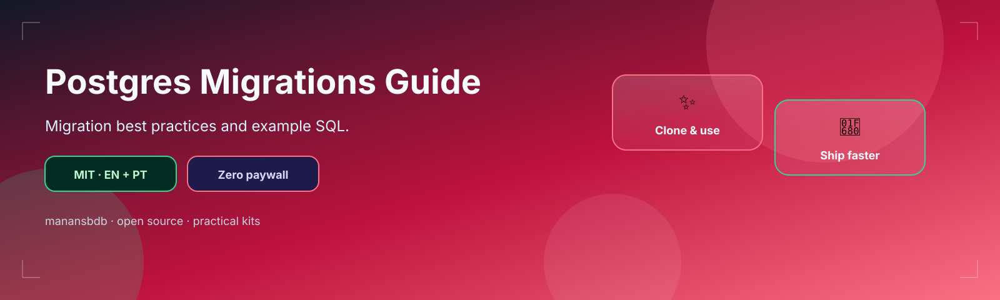

<p align="center">
  
</p>

<h1 align="center">postgres-migrations-guide</h1>

<p align="center">
  <strong>EN</strong> PostgreSQL migration best practices + sample SQL<br/>
  <strong>PT</strong> Boas práticas de migrations PostgreSQL + SQL de exemplo
</p>

<p align="center">
  <a href="https://github.com/manansbdb/postgres-migrations-guide/blob/main/LICENSE"></a>
  
  
  <a href="#support--apoio"></a>
</p>

---

## What it does / Para que serve

| English | Português |
|---------|-----------|
| Best practices for **Postgres schema migrations** plus a sample `CREATE TABLE` migration. | Boas práticas para **migrations de schema Postgres** e um exemplo `CREATE TABLE`. |
| Copy SQL into your migrations folder (Flyway, golang-migrate, Knex, etc.). | Copia o SQL para a pasta de migrations (Flyway, golang-migrate, Knex, etc.). |


---

## Install / Instalação

### 1) Clone / Clona

```bash
git clone https://github.com/manansbdb/postgres-migrations-guide.git
cd postgres-migrations-guide
```

### 2) Copy into your migrations folder / Copia

```bash
mkdir -p /path/to/your-project/migrations
cp examples/001_create_users.sql /path/to/your-project/migrations/
cp best-practices.md /path/to/your-project/docs/postgres-migrations.md
# apply with your tool, e.g.:
# psql "$DATABASE_URL" -f migrations/001_create_users.sql
```

### Requirements / Requisitos

- `git`
- PostgreSQL client (`psql`) or a migration runner

---

## Quick start / Início rápido

```bash
git clone https://github.com/manansbdb/postgres-migrations-guide.git
cp postgres-migrations-guide/examples/001_create_users.sql ./migrations/
# psql "$DATABASE_URL" -f migrations/001_create_users.sql
```

---

## Contents / Conteúdos

| Path | Purpose / Função |
|------|------------------|
| `best-practices.md` | Migration guidelines |
| `examples/001_create_users.sql` | Sample up migration |
| `SUPPORT.md` | Donations / Doações |

---

## Project layout / Estrutura

```text
postgres-migrations-guide/
├── docs/banner.svg
├── best-practices.md
├── examples/001_create_users.sql
├── SUPPORT.md
└── README.md
```

---

## Support / Apoio

Bitcoin donations welcome / Doações em Bitcoin bem-vindas:

```
bc1q0qfnlnxyum9u45stzxe0a7jnhtj4j0usfkqdjw
```

See [SUPPORT.md](./SUPPORT.md).

---

## License / Licença

[MIT](./LICENSE) © 2026 manansbdb
